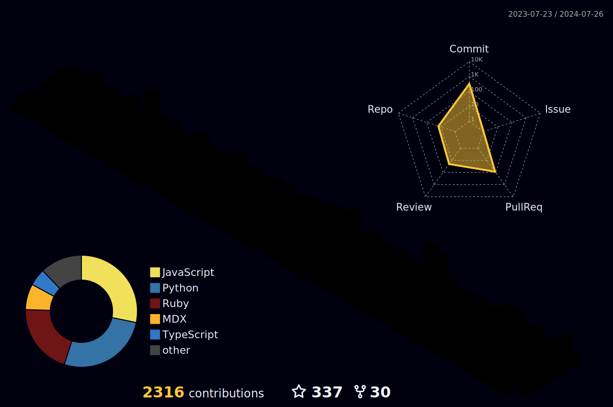

 
 

### Here are some fun facts about me:
- 💻  I enjoy solving complex problems and fixing technical issues.
- 🚀  I’m currently looking for a Job as a Backend Developer.
- 🔭  I'm a Professional Facebook 3D creator, you can find my works [here](https://www.facebook.com/infect3dstudio/)
- 👥  I’m looking to collaborate with people with Amazing Ideas.
- 🎵  I'm a music lover with a fondness for classic hits from various decades by artists such as Frank Sinatra, Bee Gees, Tears for Fears and other amazing singers.
- 📙  I love to read. I'm a Huge fan of Dan Brown, Stephen King, Anne Rice and Thomas Hardy's books.
 

## 📩 Connect with me

 
 
 

#

  

  
  
  

#

**𝙻𝙰𝙽𝙶𝚄𝙰𝙶𝙴𝚂 𝙰𝙽𝙳 𝚃𝙾𝙾𝙻𝚂:**  

 

 
 

<code></code>
<code></code>
<code></code>
<code></code>
<code></code>
<code></code>
<code></code>
<code></code>
<code></code>

#

<code></code>
<code></code>
<code></code>
<code></code>
<code></code>
<code></code>
<code></code>
<code></code>
<code></code>

#

<code></code>
<code></code>
<code></code>
<code></code>
<code></code>
<code></code>
<code></code>
<code></code>
<code></code>

 

#

**GITHUB STATS:**  

    
    

 

#

**COMPLETED HACKATHONS:**  

  
  &nbsp; &nbsp;
  
  &nbsp;
    
  &nbsp; &nbsp;
    
  &nbsp; &nbsp;
   
  &nbsp; &nbsp;
  

**ONGOING HACKATHONS:** 

    

#

**UPCOMING HACKATHONS:** 

   

#
