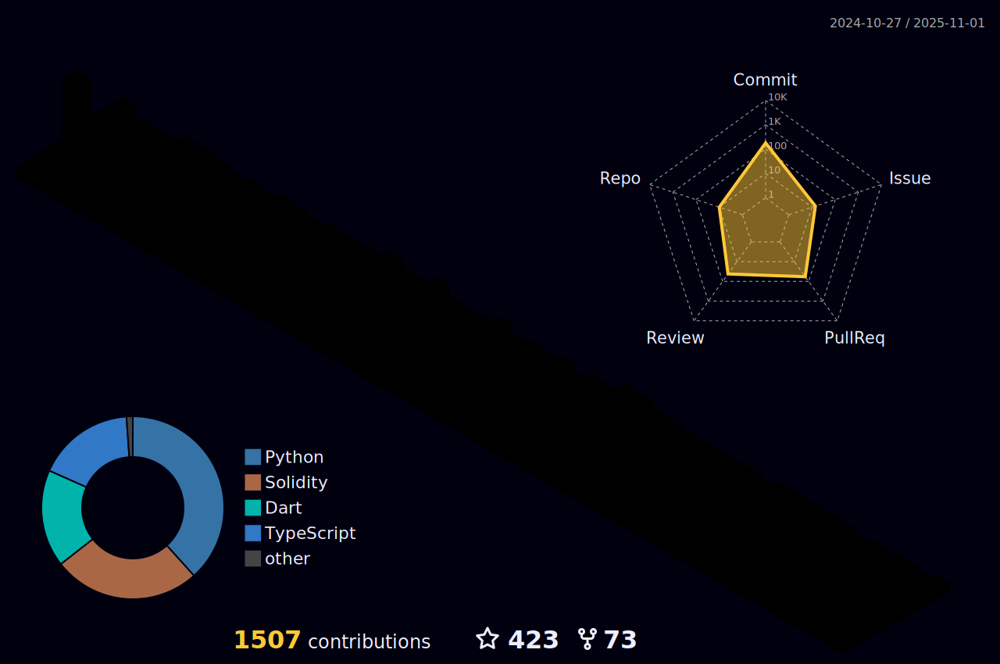

 
 

### Here are some fun facts about me:
- 💻  I enjoy solving complex problems and fixing technical issues.
- 🚀  I’m currently looking for a Job as a Backend Developer.
- 🔭  I'm a Professional Facebook 3D creator, you can find my works [here](https://www.facebook.com/infect3dstudio/).
- 👯  I’m looking to collaborate with people with Amazing Ideas.
- 🎵  Music lover with a fondness for classic hits from various decades by artists such as Frank Sinatra, Bee Gees, Tears for Fears and other amazing singers.
- 📙  I love to read, I'm a Huge fan of Dan Brown, Tom Clancy, Anne Rice and Thomas Hardy's books.
 

## 📩 Connect with me

 
 
 

#

  

  
  
  

#

 

**𝙻𝙰𝙽𝙶𝚄𝙰𝙶𝙴𝚂 𝙰𝙽𝙳 𝚃𝙾𝙾𝙻𝚂:**  

 
 

<code></code>
<code></code>
<code></code>
<code></code>
<code></code>
<code></code>
<code></code>
<code></code>
<code></code>

#

<code></code>
<code></code>
<code></code>
<code></code>
<code></code>
<code></code>
<code></code>
<code></code>
<code></code>

 

#

**𝙶ITHUB STATS :**  

    
    

 

